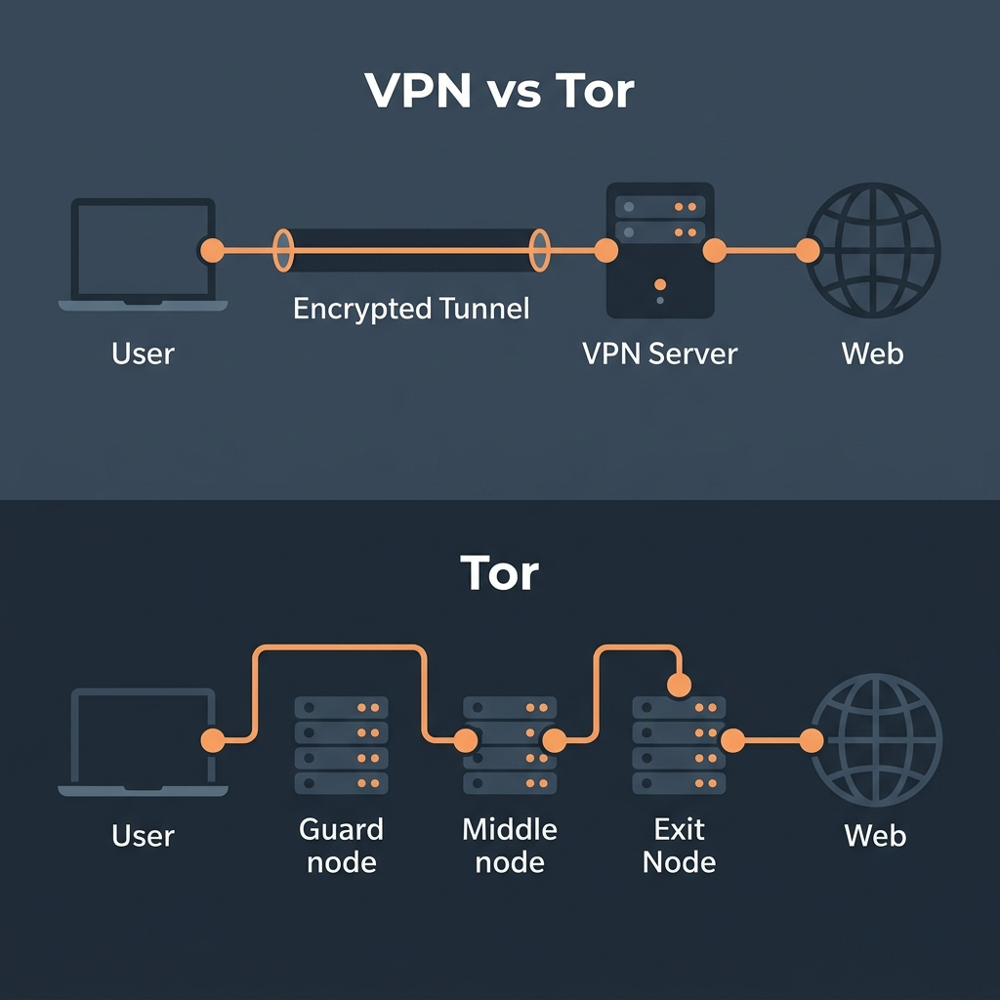

import { Steps, Aside } from '@astrojs/starlight/components';

Κάθε φορά που συνδέεστε στο Internet, αφήνετε ένα ψηφιακό αποτύπωμα. Οι σελίδες που επισκέπτεστε, οι αναζητήσεις σας και οι DNS ερωτήσεις καταγράφονται από τον πάροχο Ίντερνετ (ISP) και από διαφημιστικές εταιρείες. Εδώ θα δούμε πώς να το περιορίσουμε αυτό.

---

## 1. Επιλογή Browser & Μηχανής Αναζήτησης

### Α. Browsers (Περιηγητές)
Αποφύγετε τον Google Chrome και τον Microsoft Edge, καθώς καταγράφουν και στέλνουν telemetry (δεδομένα χρήσης) στις αντίστοιχες εταιρείες.
* **Tor Browser**: Το κορυφαίο εργαλείο για ανωνυμία. Δρομολογεί την κίνηση μέσω Tor και εμποδίζει το tracking και το fingerprinting.
* **LibreWolf**: Μια έκδοση του Firefox ρυθμισμένη αποκλειστικά για ιδιωτικότητα. Έχει απενεργοποιημένη όλη την τηλεμετρία της Mozilla, μπλοκάρει trackers out-of-the-box (με uBlock Origin) και διαγράφει cookies/ιστορικό κατά το κλείσιμο.
* **Mullvad Browser**: Σχεδιάστηκε από την ομάδα του Mullvad VPN σε συνεργασία με το Tor Project. Προσφέρει την κορυφαία προστασία fingerprinting του Tor Browser, αλλά λειτουργεί για κανονική πλοήγηση χωρίς το δίκτυο Tor (ιδανικό για καθημερινή χρήση με ή χωρίς VPN).
* **Brave**: Μια Chromium-based εναλλακτική με ενσωματωμένο ad-blocker και tracking protection.

### Β. Μηχανές Αναζήτησης
* **DuckDuckGo**: Δεν καταγράφει τις αναζητήσεις σας ούτε σας προβάλλει προσωποποιημένα αποτελέσματα.
* **Startpage**: Σας εμφανίζει τα αποτελέσματα της Google, αλλά μεσολαβεί η ίδια η Startpage ώστε η Google να μην γνωρίζει την IP ή το προφίλ σας.
* **SearXNG**: Μια αποκεντρωμένη metasearch μηχανή ανοιχτού κώδικα που συγκεντρώνει αποτελέσματα από διάφορες πηγές χωρίς να καταγράφει τίποτα.

---

## 2. Κρυπτογραφημένο DNS (DoH / DoT)

Όταν πληκτρολογείτε `gizmolab.net`, ο υπολογιστής σας κάνει μια ερώτηση DNS (Domain Name System) για να βρει την IP διεύθυνση της σελίδας. 
* **Το πρόβλημα**: Από προεπιλογή, αυτές οι ερωτήσεις στέλνονται στον πάροχό σας (ISP) σε μορφή απλού κειμένου (plaintext). Ο ISP καταγράφει έτσι κάθε domain που επισκέπτεστε, ακόμα κι αν η σύνδεσή σας είναι HTTPS.
* **Η λύση: DNS-over-HTTPS (DoH) ή DNS-over-TLS (DoT)**:
  Αυτά τα πρωτόκολλα κρυπτογραφούν τις ερωτήσεις DNS, κάνοντάς τις να φαίνονται ως κανονική κίνηση HTTPS, εμποδίζοντας τον ISP να δει ποια domains ζητάτε.
* **Πώς να το ενεργοποιήσετε**:
  1. Στον Firefox/LibreWolf: Πηγαίνετε στα *Settings > Privacy & Security > Enable Secure DNS* (επιλέξτε Max Protection).
  2. Επιλέξτε έναν πάροχο που σέβεται την ιδιωτικότητα, όπως ο **Quad9** (`9.9.9.9`), ο **Mullvad DNS** ή ο **AdGuard DNS**.

---

## 3. Virtual Private Networks (VPN)

Ένα **VPN** δημιουργεί μια κρυπτογραφημένη "σήραγγα" (tunnel) μεταξύ της συσκευής σας και ενός απομακρυσμένου VPN server.

### Τι προσφέρει:
* **Ασφάλεια σε Δημόσια Wi-Fi**: Προστατεύει τα δεδομένα σας (κωδικούς, cookies) από hackers στο ίδιο τοπικό δίκτυο.
* **Απόκρυψη από τον ISP**: Ο πάροχος βλέπει μόνο ότι είστε συνδεδεμένοι στο VPN, αλλά όχι τις σελίδες που επισκέπτεστε.
* **Παράκαμψη Λογοκρισίας**: Σας επιτρέπει να παρακάμψετε γεωγραφικούς περιορισμούς (π.χ. πρόσβαση σε μπλοκαρισμένα sites).

---

## 4. VPN vs Tor: Η κρίσιμη διαφορά στην Εμπιστοσύνη

Πολλοί πιστεύουν ότι χρησιμοποιώντας ένα VPN είναι ανώνυμοι. Αυτό είναι λάθος!

<Aside type="danger">
  ### Πού βασίζεται η ανωνυμία σας;
  * **VPN (Ιδιωτικότητα βάσει υπόσχεσης)**: 
    Το VPN απλά μεταφέρει την εμπιστοσύνη σας από τον πάροχο Ίντερνετ (ISP) στον πάροχο του VPN. Ο πάροχος του VPN βλέπει **όλη** την κίνησή σας. Αν ο πάροχος είναι δωρεάν, πιθανότατα πουλάει τα δεδομένα σας. Ακόμα και paid VPNs με πολιτική "no-logs" μπορούν να υποχρεωθούν νομικά να σας καταγράψουν.
  * **Tor (Ανωνυμία βάσει αρχιτεκτονικής)**: 
    Δεν βασίζεται στην εμπιστοσύνη σε μία εταιρεία. Λόγω των 3 relays (Guard, Middle, Exit), κανένας κόμβος δεν γνωρίζει ταυτόχρονα ποιος είστε και ποια σελίδα επισκέπτεστε. Ακόμα κι αν ο Exit Node ελέγχεται από κρατική υπηρεσία, δεν γνωρίζει την IP σας.
</Aside>
