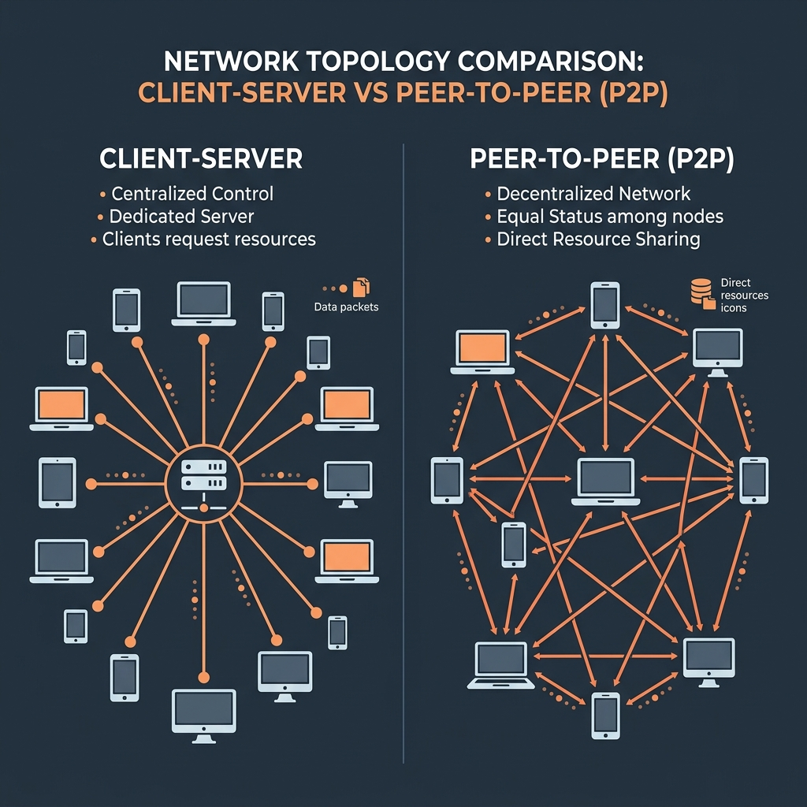
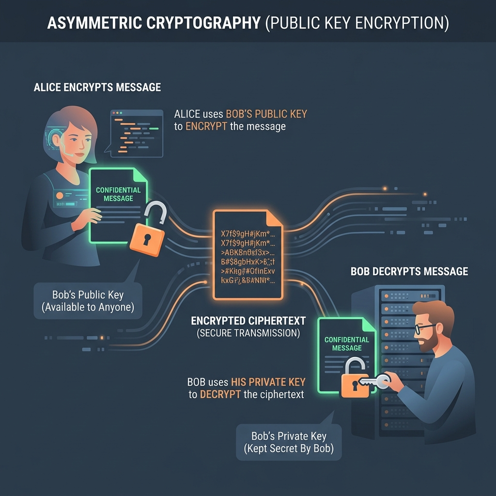

import { Steps, Aside } from '@astrojs/starlight/components';

Για να κατανοήσουμε πώς λειτουργούν τα εργαλεία ψηφιακής προστασίας (όπως το Tor, το Signal ή το PGP), πρέπει πρώτα να καταλάβουμε πώς συνδέονται οι συσκευές μας και πώς κρυπτογραφούνται τα δεδομένα.

---

## 1. Client-Server vs Peer-to-Peer (P2P)

Στο Διαδίκτυο, η επικοινωνία των συσκευών ακολουθεί δύο κύριες αρχιτεκτονικές:

### Client - Server (Κεντροποιημένη)
* **Client (Πελάτης)**: Η συσκευή σας (π.χ. ο browser) που ζητάει μια υπηρεσία.
* **Server (Διακομιστής)**: Ένα απομακρυσμένο σύστημα που παρέχει την υπηρεσία και αποθηκεύει τα δεδομένα.
* *Πρόβλημα*: Ο ιδιοκτήτης του server ελέγχει όλη την κίνηση, τα αρχεία και τα μεταδεδομένα (IP διευθύνσεις, χρόνο σύνδεσης). Αν ο server κατασχεθεί, παραβιαστεί ή κλείσει, η υπηρεσία σταματά να λειτουργεί και τα δεδομένα σας εκτίθενται.

### Peer-to-Peer (P2P - Αποκεντρωμένη)
* Οι συσκευές επικοινωνούν απευθείας μεταξύ τους (peers) **χωρίς τη μεσολάβηση κάποιου κεντρικού server**.
* Κάθε συσκευή λειτουργεί ταυτόχρονα ως client και server.
* *Πλεονέκτημα*: Δεν υπάρχει κεντρικό σημείο αποτυχίας (Single Point of Failure). Αν κάποιοι κόμβοι κλείσουν, το δίκτυο συνεχίζει να λειτουργεί. Χρησιμοποιείται στα torrents, σε P2P messengers (π.χ. Briar) και σε εργαλεία συγχρονισμού αρχείων (π.χ. Syncthing).

---

## 2. Κρυπτογράφηση Δημόσιου Κλειδιού (Ασύμμετρη)

Η ασύμμετρη κρυπτογραφία επιτρέπει σε δύο άτομα να επικοινωνήσουν με απόλυτη ασφάλεια μέσω ενός δημόσιου, μη έμπιστου καναλιού (όπως το Internet), χωρίς να χρειαστεί να μοιραστούν από πριν κάποιο κοινό μυστικό κωδικό.

Κάθε χρήστης δημιουργεί ένα ζευγάρι κλειδιών:
* **Δημόσιο Κλειδί (Public Key)**: Λειτουργεί σαν ένα **ανοιχτό λουκέτο**. Το μοιράζεστε ελεύθερα με όλο τον κόσμο (π.χ. το αναρτάτε στο site σας). Οποιοσδήποτε θέλει να σας στείλει ένα μήνυμα, το "κλειδώνει" με αυτό το κλειδί.
* **Ιδιωτικό Κλειδί (Private Key)**: Λειτουργεί σαν το **μοναδικό φυσικό κλειδί** που ξεκλειδώνει το λουκέτο. Το κρατάτε αυστηρά κρυφό στη συσκευή σας. Μόνο εσείς μπορείτε να ξεκλειδώσετε (αποκρυπτογραφήσετε) τα μηνύματα που κλειδώθηκαν με το δημόσιο κλειδί σας.

### Πώς λειτουργεί στην πράξη (Παράδειγμα Alice & Bob):
<Steps>
1. **Κρυπτογράφηση**: 
   Η Alice θέλει να στείλει ένα εμπιστευτικό μήνυμα στον Bob. Παίρνει το **δημόσιο κλειδί του Bob** (που είναι διαθέσιμο σε όλους) και κρυπτογραφεί το μήνυμα με αυτό. 
   
   Το μήνυμα μετατρέπεται σε ακαταλαβίστικο κείμενο (ciphertext) και στέλνεται μέσω Internet. Ακόμα κι αν κάποιος το υποκλέψει στο δρόμο, δεν μπορεί να το διαβάσει.
   
2. **Αποκρυπτογράφηση**: 
   Ο Bob λαμβάνει το κρυπτογραφημένο μήνυμα. Χρησιμοποιεί το **ιδιωτικό κλειδί του** (το οποίο κατέχει μόνο ο ίδιος) για να αποκρυπτογραφήσει το μήνυμα και να διαβάσει το αρχικό κείμενο της Alice.
</Steps>

<Aside type="note">
  Αυτή η τεχνολογία αποτελεί τη βάση για το **HTTPS** (ασφαλές web), το **PGP** (ασφαλή email), τα κρυπτογραφημένα chats (Signal/Matrix) και τις **ψηφιακές υπογραφές** (επαλήθευση της ταυτότητας του αποστολέα).
</Aside>
